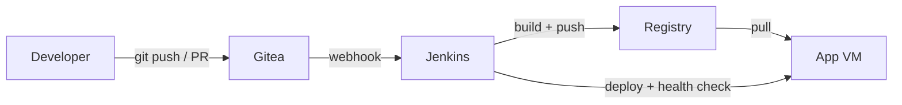

# Pushlane Homelab

Laboratorio DevOps reproducible sobre Proxmox para practicar administracion de
codigo fuente, CI/CD, Linux y operacion de servicios autogestionados.

## Objetivo

Construir este flujo sin depender de servicios SaaS:



La infraestructura se aprovisiona con OpenTofu, se configura con cloud-init y
Ansible, y despliega una API FastAPI pequena para ejercitar el pipeline.

## Alcance inicial

| Nodo | Funcion | Recursos sugeridos |
| --- | --- | --- |
| `pushlane-git` | Gitea | 2 vCPU / 2 GB RAM |
| `pushlane-ci` | Jenkins | 4 vCPU / 4 GB RAM |
| `pushlane-app` | Registry y aplicacion | 2 vCPU / 2 GB RAM |

## Requisitos

- Proxmox VE con una plantilla cloud-init de Debian o Ubuntu
- OpenTofu
- Ansible
- Acceso SSH a las VMs
- Un token de API de Proxmox con permisos minimos necesarios

## Inicio rapido

1. Copia y completa los archivos de ejemplo:

   ```bash
   cp tofu/terraform.tfvars.example tofu/terraform.tfvars
   cp ansible/inventory/hosts.yml.example ansible/inventory/hosts.yml
   ```

2. Aprovisiona las VMs:

   ```bash
   make tofu-init
   make tofu-plan
   make tofu-apply
   ```

3. Configura los servidores:

   ```bash
   make ansible-check
   make ansible-apply
   ```

4. Abre Gitea y Jenkins, crea las credenciales descritas en
   [`docs/bootstrap.md`](docs/bootstrap.md) y configura el webhook.

5. Publica `apps/demo-api` en Gitea y ejecuta el `Jenkinsfile`.

> Este repositorio es un starter kit. Antes del primer `tofu apply`, ajusta el
> ID de la plantilla, bridge, datastore, gateway e IPs a tu Proxmox.

## Estructura

```text
pushlane-homelab/
├── tofu/                 # VMs y red en Proxmox
├── cloud-init/           # Configuracion minima de arranque
├── ansible/              # Configuracion idempotente de los hosts
├── services/             # Compose de Gitea, Jenkins y despliegue
├── apps/demo-api/        # Aplicacion y pruebas del pipeline
├── pipelines/            # Jenkinsfile y futura shared library
├── monitoring/           # Espacio para la fase de observabilidad
├── docs/                 # Arquitectura, bootstrap y runbooks
├── ROADMAP.md
└── Makefile
```

## Principios del laboratorio

- Nada de secretos en Git.
- La infraestructura debe poder destruirse y reconstruirse.
- Cada fase termina con evidencia verificable.
- Los fallos se documentan como runbooks, no como folklore tribal.
- Kubernetes se agrega despues de dominar el flujo base; la sopa de YAML puede esperar.

## Roadmap

Consulta [`ROADMAP.md`](ROADMAP.md). El MVP termina cuando un push activa
automaticamente lint, tests, build, publicacion, despliegue y health check.

