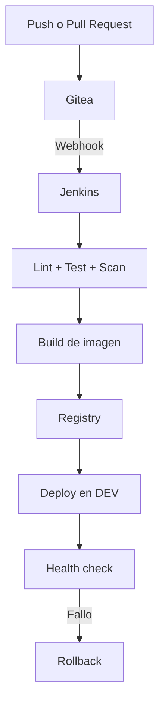

# Arquitectura

## Flujo de entrega

## Capas de automatizacion

| Capa | Herramienta | Responsabilidad |
| --- | --- | --- |
| Infraestructura | OpenTofu | Ciclo de vida de VMs en Proxmox |
| Bootstrap | cloud-init | Usuario, SSH y paquetes minimos |
| Configuracion | Ansible | Docker, directorios y servicios |
| Plataforma | Gitea/Jenkins | SCM, webhooks y pipelines |
| Entrega | OCI Registry/Compose | Publicacion y ejecucion de imagenes |

## Decisiones iniciales

- Tres VMs mantienen separados SCM, CI y runtime sin inflar el laboratorio.
- Docker Compose reduce complejidad durante el MVP.
- El registry comparte inicialmente la VM de aplicacion.
- Los ambientes adicionales, TLS, Vault y observabilidad son evoluciones.

## Red del laboratorio (valores reales)

| Parametro | Valor |
| --- | --- |
| Subred de las VMs | 10.0.0.0/24, bridge `vmbr1` (sin VLAN) |
| Gateway | 10.0.0.1 |
| DNS externo (cloud-init) | 1.1.1.1 |
| Datastore de discos | local-lvm |
| Plantilla cloud-init | noble-template (vmid 9000) |
| pushlane-git | vmid 204, 10.0.0.21 (Gitea, Technitium) |
| pushlane-ci | vmid 202, 10.0.0.22 (Jenkins) |
| pushlane-app | vmid 203, 10.0.0.23 (Registry, demo-api) |

## Nodo de control

- El laboratorio se opera desde un ECS en la Tailnet del Proxmox; alcanza
  las VMs con `ProxyJump` a traves del host PVE (root via SSH).
- El nodo de control concentra el venv de Ansible, los vaults, el `.env`
  con credenciales y el `terraform.tfstate`/`terraform.tfvars` reales
  (todos gitignored). El estado se migro desde el nodo original
  (natalia-vivobook); el ECS es ahora la version autoritativa.

## DNS interno

- Technitium DNS Server contenerizado en `pushlane-git` (rol `dns`): zona
  autoritativa `lab.local` con un registro A por host del inventario,
  gestionados via su API HTTP de forma idempotente.
- Split DNS en los hosts: systemd-resolved enruta solo `lab.local` a
  10.0.0.21 (`Domains=~`); la resolucion externa no depende del lab. Si
  Technitium cae, solo se pierde la zona interna.
- El daemon de Docker usa `[10.0.0.21, 1.1.1.1]` como DNS para que los
  contenedores resuelvan `*.lab.local` (el stub 127.0.0.53 de systemd-resolved
  no es alcanzable desde el bridge y Docker caeria a 8.8.8.8). Los contenedores
  creados antes del cambio deben recrearse para heredarlo.
- Consola web: `http://10.0.0.21:5380` (usuario `admin`; contrasena en
  `inventory/group_vars/dns/vault.yml`). Recursion limitada a redes privadas
  con forwarders 1.1.1.1/8.8.8.8.

## Limites de confianza

- Proxmox y SSH solo desde la LAN administrativa y el nodo de control
  (Tailnet).
- OpenTofu usa el token `pushlane@pve!tofu` con `privsep=1`, ACLs acotadas
  a las VMs del lab y a `local-lvm` (ver `docs/remediaciones.md`).
- Jenkins usa credenciales dedicadas para Gitea, registry y despliegue.
- La aplicacion no recibe acceso al socket de Docker ni a credenciales de CI.
- Los secretos se inyectan en tiempo de ejecucion y nunca se versionan.

