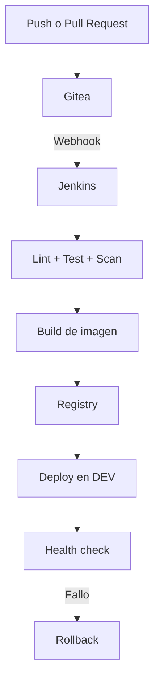

# Arquitectura

## Flujo de entrega

## Capas de automatizacion

| Capa | Herramienta | Responsabilidad |
| --- | --- | --- |
| Infraestructura | OpenTofu | Ciclo de vida de VMs en Proxmox |
| Bootstrap | cloud-init | Usuario, SSH y paquetes minimos |
| Configuracion | Ansible | Docker, directorios y servicios |
| Plataforma | Gitea/Jenkins | SCM, webhooks y pipelines |
| Entrega | OCI Registry/Compose | Publicacion y ejecucion de imagenes |

## Decisiones iniciales

- Tres VMs mantienen separados SCM, CI y runtime sin inflar el laboratorio.
- Docker Compose reduce complejidad durante el MVP.
- El registry comparte inicialmente la VM de aplicacion.
- Los ambientes adicionales, TLS, Vault y observabilidad son evoluciones.
- Las IPs y nombres del ejemplo deben sustituirse por valores de la red local.

## Limites de confianza

- Solo la LAN administrativa accede a Proxmox y SSH.
- Jenkins usa credenciales dedicadas para Gitea, registry y despliegue.
- La aplicacion no recibe acceso al socket de Docker ni a credenciales de CI.
- Los secretos se inyectan en tiempo de ejecucion y nunca se versionan.

